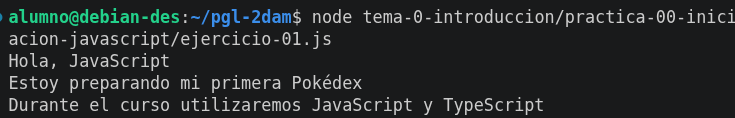
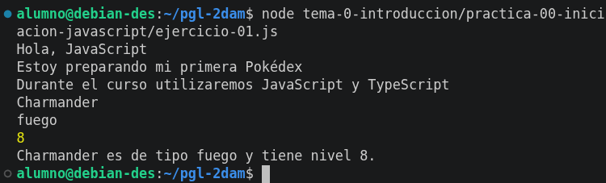
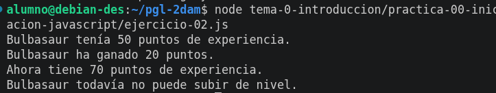

# Práctica 00. Iniciación a JavaScript

## Objetivos

En esta práctica he preparado el repositorio del módulo y he tenido una primera toma de contacto con JavaScript.

## Ejercicio 1. Mi primer programa

En el ejercicio 1 he hecho unas pruebas básicas con JavaScript, imprimiendo textos y declarando variables.

 

 

## Ejercicio 2. Operaciones básicas

En el ejercicio dos he declarado diferentes variables, de las cuales dos de ellas ("experienciaActual" y "experienciaGanada") se suman para crear otra constante nueva ("experienciaTotal") y hacer una comprobación posterior con un if. Si esta condición se cumple ("experienciaTotal >= 100") imprime un texto; en el caso contrario devuelve otro.

## Conceptos utilizados

- `console.log()`: permite mostrar información en la consola
- Variable: permite guardar un dato para utilizarlo posteriormente
- Texto: una cadena de caracteres
- Número: un número cualquiera
- Condición: permite que el programa tome una decisión

## Dificultades encontradas

En esta práctica no he tenido ninguna dificultad

## Conclusión

En esta práctica he aprendido conceptos básicos sobre JavaScript, que me han ayudado a realizar programas sencillos.