# Desarrollo de una Pokédex con JavaScript

**Nombre**: Atteneri Bravo Barroso

**Descripción del proyecto**: Pokédex web que permite consultar información de los 151 primeros Pokémon mediante datos obtenidos de la API de PokéAPI. La aplicación permite buscar Pokémon por nombre o número, filtrarlos por tipo y consultar información ampliada como sus tipos, altura, peso, experiencia, habilidades y estadísticas base. También incluye gestión de estados de carga, búsquedas sin resultados y errores de conexión.

**Tecnologías usadas**: 

- HTML5
- CSS3
- JavaScript
- API REST de PokéAPI
- Visual Studio Code
- Live Server

**Instrucciones de ejecución**:

1. Descargar o clonar el proyecto.
2. Abrir la carpeta del proyecto en Visual Studio Code.
3. Instalar la extensión Live Server si no está instalada.
4. Abrir el archivo index.html.
5. Pulsar con el botón derecho sobre index.html y seleccionar Open with Live Server.
6. La aplicación se abrirá en el navegador.

<br>

## 1. Punto de partida

Para comenzar el proyecto he creado una mini-pokedex inicial que contiene un html y css sencillos, y una app.js que se conecta a [PokéAPI](https://pokeapi.co/) y realiza la búsqueda de un Pokémon devolviendo algunos de sus datos.

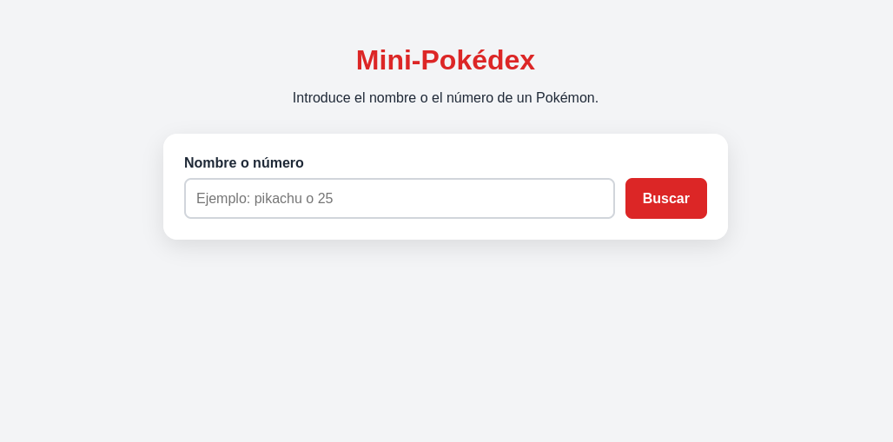


### Estructura de carpetas y archivos inicial

```
mini-pokedex/
├── assets/
│   └── img/
├── css/
│   └── style.css
├── js/
│   └── app.js
├── index.html
└── README.md
```

### Funcionalidades ya implementadas

- Buscar un Pokémon introduciendo su nombre o número

    `const busqueda = inputBusqueda.value.trim().toLowerCase();`

- Obtener datos desde [PokéAPI](https://pokeapi.co/) extrayendo el número, nombre, imagen, altura, peso y tipos

    ```const url = `https://pokeapi.co/api/v2/pokemon/${busqueda}`;
const respuesta = await fetch(url);```

- Mostrar la información del Pokémon creando dinámicamente una tarjeta con sus datos

    `mostrarPokemon(pokemon);`

- Mostrar los tipos del Pokémon (si tiene uno o varios)

    
    ```pokemon.tipos.map((tipo) => `<span class="tipo">${tipo}</span>`).join("");```


- Formatear el número del Pokémon añadiendo ceros delante del número para que siempre tenga tres cifras

    `formatearId(25);`

- Mostrar un mensaje de carga mientras se busca el Pokémon

    `mensaje.textContent = "Cargando...";`

- Desactivar el botón "Buscar" mientras se realiza una búsqueda para evitar que se hagan varias búsquedas simultáneamente

    `botonBuscar.disabled = true;`

- Volver a activar el botón "Buscar" cuando la búsqueda termina

    `botonBuscar.disabled = false;`

- Permitir buscar pulsando Enter

    `formulario.addEventListener("submit", async (evento) => {`

- Limpiar el formulario después de una búsqueda correcta, vaciando el campo de búsqueda y volviendo a colocar el cursor sobre él

    `inputBusqueda.value = "";`
    
    `inputBusqueda.focus();`

<br>    

La app también gestiona Pokémon inexistentes y otros errores controlados como al pulsar el botón de "Buscar" sin haber introducido nada en la barra de búsqueda.


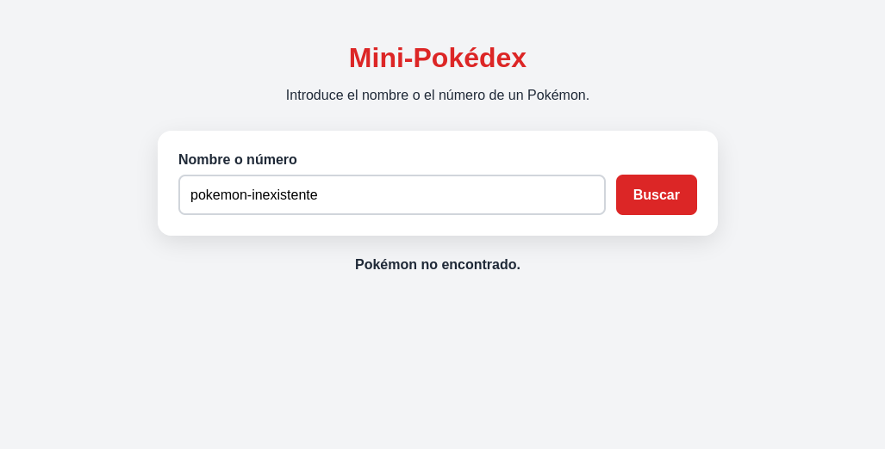


Commits de este punto de partida: 

https://github.com/Atthemyg/pgl-2dam/commit/17fb5001003414a78b19f438b13954b100ede130

https://github.com/Atthemyg/pgl-2dam/commit/4083b9295523b92f6cc9857e3b749898707f7aff


## 2. Carga inicial

He añadido un encabezado con el logotipo de la Pokedex añadiendo al html la imagen:

```
<header class="encabezado">
      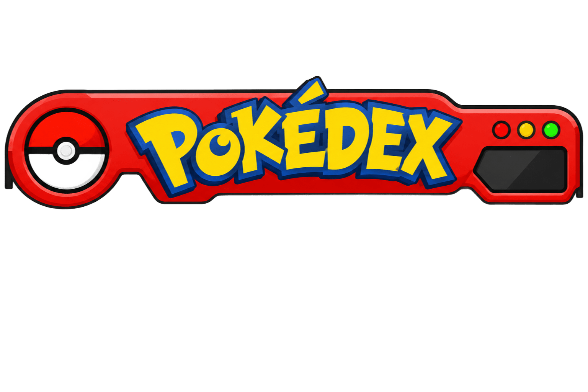
</header>
```

Y haciendo algunos cambios en el css para que quede centrado en la pantalla:

```
body {
  margin: 0;
  padding: 0.5rem 1rem 2rem;
  font-family: Arial, sans-serif;
  color: #1f2937;
  background: #f3f4f6;
}

.contenedor {
  width: min(100%, 650px);
  margin: 0 auto;
}

.encabezado {
  width: 100%;
  text-align: center;
  position: relative;
  z-index: 1;
}

.encabezado__imagen {
  display: block;
  width: 100%;
  height: auto;
  margin: 0 auto;
  transform: scale(1.3);
}

.introduccion {
  margin-bottom: 0.5rem; 
  text-align: center;
  margin-top: -170px;
}

.buscador {
  padding: 1.5rem;
  background: white;
  border-radius: 1rem;
  box-shadow: 0 8px 25px rgb(0 0 0 / 10%);
  margin-top: 30px;
  position: relative;
  z-index: 2;
}
```

<br>


## 3. Cambio de sprite

Al buscar un Pokémon la imagen que aparecerá por defecto es de espaldas, pero al pasar el cursor por encima, la imagen cambia a la del Pokémon de frente.

Para conseguirlo modifico el código de JavaScript para que tome las dos imágenes de la API:

```
return {
    id: datos.id,
    nombre: datos.name,
    imagenBack: datos.sprites.back_default,
    imagenFront: datos.sprites.front_default,
    altura: datos.height,
    peso: datos.weight,
    tipos: datos.types.map(({ type }) => type.name),
  };
```

Y a continuación modifico el innerHTML para que ambas imágenes se muestren:

```
<div class="galeria_pokemon">
      
      
</div>
```
Por último, modifico el css para que las imágenes queden superpuestas en la misma posición, y que además se produzca una transición de opacidad al cambiar la imagen cuando se le pase el cursor por encima. 

```
.galeria_pokemon {
  display: grid;
  width: 180px;
  height: 180px;
  image-rendering: pixelated;
  margin: 0 auto;
}

.pokemon__imagen_back, 
.pokemon__imagen_front {
  position: absolute;
  width: 180px;
  height: 180px;
  image-rendering: pixelated;
  transition: opacity 0.25s ease-in-out;
}

.pokemon__imagen_back {
  opacity: 1;
}

.pokemon__imagen_front {
  opacity: 0;
}

.pokemon:hover .pokemon__imagen_front {
  opacity: 1;
}

.pokemon:hover .pokemon__imagen_back {
  opacity: 0;
}
```
<br>

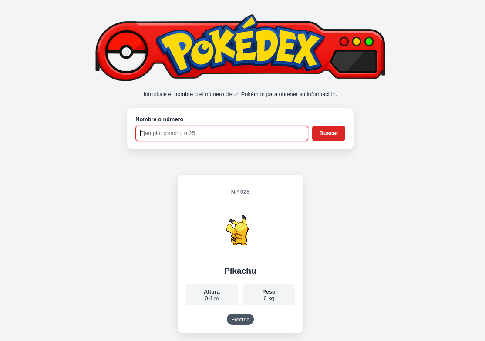

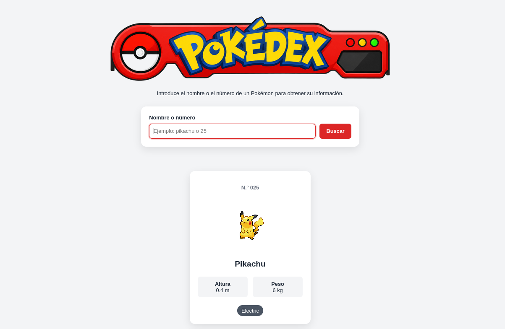


## 4. Barra de búsqueda

Para mejorar las búsquedas, he implementado algunas modificaciones. En lugar de buscar al Pokémon únicamente por su nombre completo o número, ahora se pueden buscar por un fragmento de su nombre también.

Para ello, ya no mostraremos un solo Pokémon, sino que mostraremos por ejemplo 151. 

Primero, hay que cambiar la función de `const obtenerPokemon = async (busqueda) => {`, la cual solo obtenía un Pokémon, por `const obtenerPokemons = async () => {`, ya que no necesitamos busqueda como parámetro porque la función ya no recibe una búsqueda.

Luego, tenemos que reemplazar la anterior petición a la API, la cual únicamente devolvía el Pokémon a buscar:

``const url = `https://pokeapi.co/api/v2/pokemon/${busqueda}`;``

`const respuesta = await fetch(url);`

por una que devuelve una lista de 151 Pokémon:

``const respuesta = await fetch(`https://pokeapi.co/api/v2/pokemon?limit=151`);``

Una vez hecho esto, haremos una petición por cada Pokémon con la siguiente función: 

```
const datos = await respuesta.json();

const pokemons = await Promise.all(
  datos.results.map(async (pokemon) => {
    const respuestaPokemon = await fetch(pokemon.url);
    const datosPokemon = await respuestaPokemon.json();
```

`datos.results` es la lista de los 151 Pokémon que recorre `.map()`. Una vez que se asegura de que el Pokémon existe, `const respuestaPokemon = await fetch(pokemon.url);` realiza la siguiente petición que es algo como: "Vale, dame todos los datos de Pikachu."

Después, `const datosPokemon = await respuestaPokemon.json();` guarda todos sus datos.

Ahora podemos crear nuestro objeto Pokémon filtrando la información que nos interese:

```
return {
  id: datosPokemon.id,
  nombre: datosPokemon.name,
  imagenBack: datosPokemon.sprites.back_default,
  imagenFront: datosPokemon.sprites.front_default,
  altura: datosPokemon.height,
  peso: datosPokemon.weight,
  tipos: datosPokemon.types.map(({ type }) => type.name),
};
```

El `Promise.all(...)` espera a que todas nuestras operaciones asíncronas terminen. Por lo que al final, tendremos 151 `pokemons`.

Nuestra función `obtenerPokemons` completa quedaría así:

```
const obtenerPokemons = async () => {
const respuesta = await fetch(`https://pokeapi.co/api/v2/pokemon?limit=151`);

  if (!respuesta.ok) {
    throw new Error("No se han podido cargar los Pokémon.");
  }

  const datos = await respuesta.json();

  const pokemons = await Promise.all(
    datos.results.map(async (pokemon) => {
      const respuestaPokemon = await fetch(pokemon.url);
      const datosPokemon = await respuestaPokemon.json();

      return {
        id: datosPokemon.id,
        nombre: datosPokemon.name,
        imagenBack: datosPokemon.sprites.back_default,
        imagenFront: datosPokemon.sprites.front_default,
        altura: datosPokemon.height,
        peso: datosPokemon.weight,
        tipos: datosPokemon.types.map(({ type }) => type.name),
      };

    })
  )
  return pokemons;
};
```

Para guardar nuestros 151 Pokémon crearemos una variable `let pokemons = [];`, así no tendremos que volver a pedirlos a la API cada vez que escribamos en el buscador.

Ahora vamos a cambiar nuestra función `const mostrarPokemon = (pokemon) => {` por `const mostrarPokemons = (pokemons) => {` que recibirá nuestra lista.

Sustituiremos:
  ```
  const tiposHTML = pokemon.tipos
    .map((tipo) => `<span class="tipo">${tipo}</span>`)
    .join("");
  ```
por:

```
resultado.innerHTML = pokemons
  .map((pokemon) => {
    const tiposHTML = pokemon.tipos
        .map((tipo) => `<span class="tipo">${tipo}</span>`)
        .join("");
```
para que recorra todos los Pokémon y cree un HTML para cada uno.

La función `mostrarPokemons` completa sería esta:

```
const mostrarPokemons = (pokemons) => {
  resultado.innerHTML = pokemons
    .map((pokemon) => {
      const tiposHTML = pokemon.tipos
        .map((tipo) => `<span class="tipo">${tipo}</span>`)
        .join("");

      return `
        <article class="pokemon">
          <p class="pokemon__numero">N.º ${formatearId(pokemon.id)}</p>

          <div class="galeria_pokemon">
            

            
          </div>

          <h2 class="pokemon__nombre">${pokemon.nombre}</h2>

          <div class="pokemon__datos">
            <p><strong>Altura</strong><br>${pokemon.altura / 10} m</p>
            <p><strong>Peso</strong><br>${pokemon.peso / 10} kg</p>
          </div>

          <div class="pokemon__tipos">
            ${tiposHTML}
          </div>
        </article>
      `;
    })
    .join("");
};
```

<br>

Modificando las funciones anteriores hemos obtenido los 151 Pokémon, pero todavía falta nuestro objetivo principal, que se pueda buscar nuestro objetivo con solo un fragmento de su nombre.

Para conseguirlo, vamos a crear la función `const filtrarPokemons = () => {` que se encargará de leer lo que ha escrito el usuario y decidir qué Pokémon mostrar.

```
const filtrarPokemons = () => {
  const busqueda = inputBusqueda.value.trim().toLowerCase();

  if (!busqueda) {
    mensaje.textContent = "";
    mostrarPokemons(pokemons);
    return;
  }

  const coincidencias = pokemons.filter((pokemon) => {
    return (
      pokemon.nombre.includes(busqueda) ||
      String(pokemon.id) === busqueda
    );
  });
```

El `const busqueda = inputBusqueda.value.trim().toLowerCase();` obtiene lo que ha escrito el usuario, elimina los espacios al principio y al final con `.trim()`, y convierte todo a minúscula con `.toLowerCase()`.


`if (!busqueda) {
    mensaje.textContent = "";
    mostrarPokemons(pokemons);
    return;
  }` 
  permite mostrar los 151 Pokémon si el buscador está vacío.

Por último, `const coincidencias = pokemons.filter((pokemon) => {` sirve para quedarse solamente con los elementos que cumplen una condición; `pokemon.nombre.includes(busqueda)` se asegura de que el nombre contiene lo que ha escrito el usuario (por ejemplo: "charmander".includes("char") da true); y `String(pokemon.id) === busqueda` busca por el número tras haberlo convertido en texto.

Por otro lado, para controlar errores si no encontramos ningún Pokémon que coincida añadiremos:

```
if (coincidencias.length === 0) {
    mensaje.textContent = "No se ha encontrado ningún Pokémon.";
    resultado.innerHTML = "";
    return;
  }
```

en el caso contrario devolverá:

```
mensaje.textContent = "";
mostrarPokemons(coincidencias);
```

<br>

Cuando tengamos eso, para hacer que la app filtre mientras escribimos vamos a incluir esta línea: `inputBusqueda.addEventListener("input", filtrarPokemons);` y a cambiar el evento del formulario por:

```
formulario.addEventListener("submit", (evento) => {
  evento.preventDefault();
  filtrarPokemons();
});
```

Antes el formulario hacía una petición a la API cada vez que pulsabamos "Buscar". Eso ya no tiene sentido porque los 151 Pokémon ya están guardados en `pokemons`.

`evento.preventDefault();` sirve para que el formulario no intente recargar la página. Después simplemente se ejecuta el `filtrarPokemons()`.

<br>

Lo último que nos falta es la función `const iniciarApp = async () => {`, que se encargará de iniciar la app.

```
const iniciarApp = async () => {
  try {
    mensaje.textContent = "Cargando Pokémon...";

    pokemons = await obtenerPokemons();

    mensaje.textContent = "";
    mostrarPokemons(pokemons);
  } catch (error) {
    mensaje.textContent = error.message;
  }
};
```

`pokemons = await obtenerPokemons();` descarga los 151 Pokémon y los guarda en nuestra variable global `pokemons` antes de que `mostrarPokemons(pokemons);` los muestre creando sus correspondientes tarjetas. Si llega a ocurrir algún error se mostrará un mensaje.


En resumen, todo el código de la app.js sería:

```
const formulario = document.querySelector("#formulario-busqueda");
const inputBusqueda = document.querySelector("#busqueda");
const mensaje = document.querySelector("#mensaje");
const resultado = document.querySelector("#resultado");

let pokemons = [];

const obtenerPokemons = async () => {
  const respuesta = await fetch(`https://pokeapi.co/api/v2/pokemon?limit=151`);

  if (!respuesta.ok) {
    throw new Error("No se han podido cargar los Pokémon.");
  }

  const datos = await respuesta.json();

  const pokemons = await Promise.all(
    datos.results.map(async (pokemon) => {
      const respuestaPokemon = await fetch(pokemon.url);
      const datosPokemon = await respuestaPokemon.json();

      return {
        id: datosPokemon.id,
        nombre: datosPokemon.name,
        imagenBack: datosPokemon.sprites.back_default,
        imagenFront: datosPokemon.sprites.front_default,
        altura: datosPokemon.height,
        peso: datosPokemon.weight,
        tipos: datosPokemon.types.map(({ type }) => type.name),
      };

    })
  )
  return pokemons;
};

const formatearId = (id) => {
  return String(id).padStart(3, "0");
};

const mostrarPokemons = (pokemons) => {
  resultado.innerHTML = pokemons
    .map((pokemon) => {
      const tiposHTML = pokemon.tipos
        .map((tipo) => `<span class="tipo">${tipo}</span>`)
        .join("");

      return `
        <article class="pokemon">
          <p class="pokemon__numero">N.º ${formatearId(pokemon.id)}</p>

          <div class="galeria_pokemon">
            

            
          </div>

          <h2 class="pokemon__nombre">${pokemon.nombre}</h2>

          <div class="pokemon__datos">
            <p><strong>Altura</strong><br>${pokemon.altura / 10} m</p>
            <p><strong>Peso</strong><br>${pokemon.peso / 10} kg</p>
          </div>

          <div class="pokemon__tipos">
            ${tiposHTML}
          </div>
        </article>
      `;
    })
    .join("");
};

const filtrarPokemons = () => {
  const busqueda = inputBusqueda.value.trim().toLowerCase();

  if (!busqueda) {
    mensaje.textContent = "";
    mostrarPokemons(pokemons);
    return;
  }

  const coincidencias = pokemons.filter((pokemon) => {
    return (
      pokemon.nombre.includes(busqueda) ||
      String(pokemon.id) === busqueda
    );
  });

  if (coincidencias.length === 0) {
    mensaje.textContent = "No se ha encontrado ningún Pokémon.";
    resultado.innerHTML = "";
    return;
  }

  mensaje.textContent = "";
  mostrarPokemons(coincidencias);
};

inputBusqueda.addEventListener("input", filtrarPokemons);

formulario.addEventListener("submit", (evento) => {
  evento.preventDefault();
  filtrarPokemons();
});

const iniciarApp = async () => {
  try {
    mensaje.textContent = "Cargando Pokémon...";

    pokemons = await obtenerPokemons();

    mensaje.textContent = "";
    mostrarPokemons(pokemons);
  } catch (error) {
    mensaje.textContent = error.message;
  }
};

iniciarApp();
```

Para finalizar, hacemos un pequeño cambio en el css para colocar 6 tarjetas por fila y centradas en la pantalla:

```
.resultado {
  display: grid;
  grid-template-columns: repeat(6, 1fr);
  gap: 1rem;
  justify-content: center;
}
```

Con este apartado hecho, nuestra app:

- Realiza la búsqueda ignorando espacios innecesarios y diferencias entre mayúsculas y minúsculas

- Muestra únicamente las tarjetas que coincidan con lo que ha escrito el usuario

- Muestra nuevamente los 151 Pokémon cuando la barra esta vacía

<br>

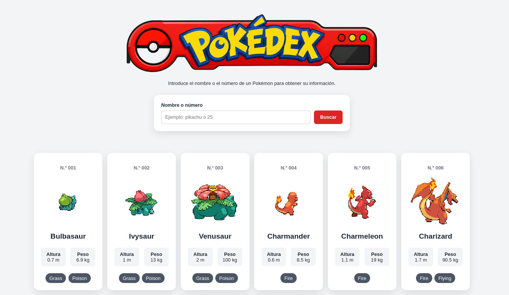


## 5. Información ampliada

Para que nuestra Pokédex quede más completa, vamos a añadir un botón "Ver detalles" que nos ampliará la información de cada uno de los Pokémon.

Lo primero que haremos es añadir nuevos datos a la petición de la API. En la función `obtenerPokemons()` ampliaremos el objeto que devuelve la API con tres propiedades nuevas:

```
experiencia: datosPokemon.base_experience,

habilidades: datosPokemon.abilities.map(({ ability }) => ability.name),

estadisticas: datosPokemon.stats.map(({ base_stat, stat }) => ({
  nombre: stat.name,
  valor: base_stat,
})),
```

`experiencia: datosPokemon.base_experience,` guarda la experiencia base del Pokémon, obtenida de `base_experience`.

`habilidades: datosPokemon.abilities.map(({ ability }) => ability.name),` obtiene los nombres de todas las habilidades del Pokémon. Utilizamos `.map()` para recorrer las habilidades y quedarnos únicamente con sus nombres.

`estadisticas: datosPokemon.stats.map(({ base_stat, stat }) => ({
  nombre: stat.name,
  valor: base_stat,
})),` obtiene las estadísticas base del Pokémon. Cada estadística se guarda como un objeto con dos propiedades:

`nombre`: el nombre de la estadística.

`valor`: el valor numérico de esa estadística.

Así podremos mostrar estadísticas como `hp`, `attack`, `defense`, `special-attack`, `special-defense` y `speed`.

La función completa quedaría así:

```
const obtenerPokemons = async () => {
  const respuesta = await fetch(`https://pokeapi.co/api/v2/pokemon?limit=151`);

  if (!respuesta.ok) {
    throw new Error("No se han podido cargar los Pokémon.");
  }

  const datos = await respuesta.json();

  const pokemons = await Promise.all(
    datos.results.map(async (pokemon) => {
      const respuestaPokemon = await fetch(pokemon.url);
      const datosPokemon = await respuestaPokemon.json();

      return {
        id: datosPokemon.id,
        nombre: datosPokemon.name,
        imagenBack: datosPokemon.sprites.back_default,
        imagenFront: datosPokemon.sprites.front_default,
        altura: datosPokemon.height,
        peso: datosPokemon.weight,
        tipos: datosPokemon.types.map(({ type }) => type.name),
        experiencia: datosPokemon.base_experience,
        habilidades: datosPokemon.abilities.map(({ ability }) => ability.name),
        estadisticas: datosPokemon.stats.map(({ base_stat, stat }) => ({
          nombre: stat.name,
          valor: base_stat,
        })),
      };
```

<br>

A continuación, vamos a añadir el botón «Ver detalles» a cada tarjeta.
Dentro de la función `mostrarPokemons()`, añadiremos este bloque al HTML que se genera para cada Pokémon:

```
<div class="boton_detalles">
  <button class="boton-detalles" data-id="${pokemon.id}">
    Ver detalles
  </button>
</div>
```

El atributo `data-id` es muy importante porque permite saber qué Pokémon ha seleccionado el usuario.

Por ejemplo, el botón de Bulbasaur guarda el identificador `1`, mientras que el de Ivysaur guarda el `2`.

La función completa:

```
const mostrarPokemons = (pokemons) => {
  resultado.innerHTML = pokemons
    .map((pokemon) => {
      const tiposHTML = pokemon.tipos
        .map((tipo) => `<span class="tipo">${tipo}</span>`)
        .join("");

      return `
        <article class="pokemon">
          <p class="pokemon__numero">N.º ${formatearId(pokemon.id)}</p>

          <div class="galeria_pokemon">
            

            
          </div>

          <h2 class="pokemon__nombre">${pokemon.nombre}</h2>

          <div class="pokemon__datos">
            <p><strong>Altura</strong><br>${pokemon.altura / 10} m</p>
            <p><strong>Peso</strong><br>${pokemon.peso / 10} kg</p>
          </div>

          <div class="pokemon__tipos">
            ${tiposHTML}
          </div>
          <div class="boton_detalles">
            <button class="boton-detalles" data-id="${pokemon.id}">
              Ver detalles
            </button>
          </div>
        </article>
      `;
    })
    .join("");
};
```

Ahora todas las tarjetas tienen un botón para consultar su información ampliada.

<br>

Añadiremos el contenedor del panel al `index.html` dentro del contenedor principal, antes de cargar el archivo JavaScript:

`<div id="panel-detalles" class="panel-detalles" hidden></div>`

El HTML quedaría:

```
<!DOCTYPE html>
<html lang="es">

<head>
  <meta charset="UTF-8">
  <meta name="viewport" content="width=device-width, initial-scale=1.0">
  <title>Pokédex</title>
  <link rel="stylesheet" href="css/style.css">
</head>

<body>
  <main class="contenedor">

    <header class="encabezado">
      
    </header>

    <p class="introduccion">
      Introduce el nombre o el número de un Pokémon para obtener su información.
    </p>

    <form id="formulario-busqueda" class="buscador">
      <label for="busqueda">Nombre o número</label>

      <div class="buscador__controles">
        <input id="busqueda" name="busqueda" type="text" placeholder="Ejemplo: pikachu o 25" autocomplete="off">

        <button type="submit">Buscar</button>

      </div>
    </form>

    <p id="mensaje" class="mensaje" aria-live="polite"></p>

    <section id="resultado" class="resultado"></section>
    <div id="panel-detalles" class="panel-detalles" hidden></div>
  </main>

  <script src="js/app.js"></script>
</body>

</html>
```

<br>

Para que JavaScript pueda modificar el contenido, mostrarlo y ocultarlo tenemos que seleccionar el panel al principio de la `app.js`:

`const panelDetalles = document.querySelector("#panel-detalles");`

Esta instrucción busca el elemento HTML que tiene el identificador `panel-detalles` y guarda una referencia a él.

```
const formulario = document.querySelector("#formulario-busqueda");
const inputBusqueda = document.querySelector("#busqueda");
const mensaje = document.querySelector("#mensaje");
const resultado = document.querySelector("#resultado");
const panelDetalles = document.querySelector("#panel-detalles");
```

<br>

Para mostrar la información ampliada crearemos la función `const mostrarDetalles = (pokemon) => {` que recibe como parámetro el Pokémon del que queremos mostrar la información.

Recorreremos los tipos del Pokémon y generaremos un elemento HTML para cada uno, por ejemplo, si un Pokémon tiene dos tipos, se muestran dos etiquetas:

```
const tiposHTML = pokemon.tipos
  .map((tipo) => `<span class="tipo">${tipo}</span>`)
  .join("");
```

También, recorreremos las habilidades y crearemos un elemento `<li>` para cada una, así podemos mostrar todas las habilidades del Pokémon dentro de una lista:

```
const habilidadesHTML = pokemon.habilidades
  .map((habilidad) => `<li>${habilidad}</li>`)
  .join("");
```

Haremos lo mismo con las estadísticas, recorreremos las estadísticas y mostraremos su nombre junto con su valor:

```
const estadisticasHTML = pokemon.estadisticas
  .map(
    (estadistica) => `
      <li>
        <strong>${estadistica.nombre}</strong>: ${estadistica.valor}
      </li>
    `
  )
  .join("");
```

Por último, utilizaremos `innerHTML` para introducir el contenido del panel y un botón de "Cerrar":

```
panelDetalles.innerHTML = `
    <div class="panel-detalles__contenido">
      <button class="panel-detalles__cerrar" type="button">
        Cerrar
      </button>

      <p>N.º ${formatearId(pokemon.id)}</p>

      <h2>${pokemon.nombre}</h2>

      

      <div class="pokemon__tipos">
        ${tiposHTML}
      </div>

      <div class="panel-detalles__datos">
      <div>
        <strong>Altura</strong>
        <span>${pokemon.altura / 10} m</span>
      </div>

      <div>
        <strong>Peso</strong>
        <span>${pokemon.peso / 10} kg</span>
      </div>

      <div>
        <strong>Experiencia</strong>
        <span>${pokemon.experiencia}</span>
      </div>
    </div>

      <h3>Habilidades</h3>
      <ul>
        ${habilidadesHTML}
      </ul>

      <h3>Estadísticas base</h3>
      <ul>
        ${estadisticasHTML}
      </ul>
    </div>
  `;
```

Al final añadimos `panelDetalles.hidden = false;` para eliminar el estado oculto del panel y permitir que se vea en pantalla.

Por tanto, cada vez que llamamos a `mostrarDetalles(pokemon)`, se generará la información del Pokémon y se mostrará el panel:

```
const mostrarDetalles = (pokemon) => {
  const tiposHTML = pokemon.tipos
    .map((tipo) => `<span class="tipo">${tipo}</span>`)
    .join("");


  const habilidadesHTML = pokemon.habilidades
    .map((habilidad) => `<li>${habilidad}</li>`)
    .join("");

  const estadisticasHTML = pokemon.estadisticas
    .map(
      (estadistica) => `
        <li>
          <strong>${estadistica.nombre}</strong>: ${estadistica.valor}
        </li>
      `
    )
    .join("");

  panelDetalles.innerHTML = `
    <div class="panel-detalles__contenido">
      <button class="panel-detalles__cerrar" type="button">
        Cerrar
      </button>

      <p>N.º ${formatearId(pokemon.id)}</p>

      <h2>${pokemon.nombre}</h2>

      

      <div class="pokemon__tipos">
        ${tiposHTML}
      </div>

      <div class="panel-detalles__datos">
      <div>
        <strong>Altura</strong>
        <span>${pokemon.altura / 10} m</span>
      </div>

      <div>
        <strong>Peso</strong>
        <span>${pokemon.peso / 10} kg</span>
      </div>

      <div>
        <strong>Experiencia</strong>
        <span>${pokemon.experiencia}</span>
      </div>
    </div>

      <h3>Habilidades</h3>
      <ul>
        ${habilidadesHTML}
      </ul>

      <h3>Estadísticas base</h3>
      <ul>
        ${estadisticasHTML}
      </ul>
    </div>
  `;

  panelDetalles.hidden = false;
};
```

<br>

Para que el botón "Ver detalles" funcione hay que añadir un evento `click` al contenedor de las tarjetas:

```
resultado.addEventListener("click", (evento) => {
  if (!evento.target.classList.contains("boton-detalles")) {
    return;
  }

  const id = Number(evento.target.dataset.id);

  const pokemon = pokemons.find((pokemon) => pokemon.id === id);

  mostrarDetalles(pokemon);
});
```

`resultado.addEventListener("click", (evento) => {` escucha los clics que se producen dentro del contenedor de resultados.

`if (!evento.target.classList.contains("boton-detalles")) {
  return;
}` comprueba que se ha pulsado el botón correcto. Esto evita que se abra el panel al pulsar otras partes de la tarjeta.

`const id = Number(evento.target.dataset.id);` lee el valor guardado en `data-id` y lo convierte a número.

`const pokemon = pokemons.find((pokemon) => pokemon.id === id);` utiliza `.find()` para localizar dentro del array `pokemons` el Pokémon cuyo identificador coincide con el del botón.

`mostrarDetalles(pokemon);` pasa el Pokémon encontrado a la función que construye y muestra el panel con los detalles.

<br>

Por otro lado, tenemos que añadir igualmente una función que cierre el panel para permitir que el usuario cierre la ventana sin recargar la página. Esta comprueba si el elemento pulsado tiene la clase `panel-detalles__cerrar`, si es así se establece `hidden = true` y se oculta el panel:

```
panelDetalles.addEventListener("click", (evento) => {
  if (!evento.target.classList.contains("panel-detalles__cerrar")) {
    return;
  }

  panelDetalles.hidden = true;
});
```

Toda la clase `app.js` tiene que quedar así:

```
const formulario = document.querySelector("#formulario-busqueda");
const inputBusqueda = document.querySelector("#busqueda");
const mensaje = document.querySelector("#mensaje");
const resultado = document.querySelector("#resultado");
const panelDetalles = document.querySelector("#panel-detalles");

let pokemons = [];

const obtenerPokemons = async () => {
  const respuesta = await fetch(`https://pokeapi.co/api/v2/pokemon?limit=151`);

  if (!respuesta.ok) {
    throw new Error("No se han podido cargar los Pokémon.");
  }

  const datos = await respuesta.json();

  const pokemons = await Promise.all(
    datos.results.map(async (pokemon) => {
      const respuestaPokemon = await fetch(pokemon.url);
      const datosPokemon = await respuestaPokemon.json();

      return {
        id: datosPokemon.id,
        nombre: datosPokemon.name,
        imagenBack: datosPokemon.sprites.back_default,
        imagenFront: datosPokemon.sprites.front_default,
        altura: datosPokemon.height,
        peso: datosPokemon.weight,
        tipos: datosPokemon.types.map(({ type }) => type.name),
        experiencia: datosPokemon.base_experience,
        habilidades: datosPokemon.abilities.map(({ ability }) => ability.name),
        estadisticas: datosPokemon.stats.map(({ base_stat, stat }) => ({
          nombre: stat.name,
          valor: base_stat,
        })),
      };

    })
  )
  return pokemons;
};

const formatearId = (id) => {
  return String(id).padStart(3, "0");
};

const mostrarPokemons = (pokemons) => {
  resultado.innerHTML = pokemons
    .map((pokemon) => {
      const tiposHTML = pokemon.tipos
        .map((tipo) => `<span class="tipo">${tipo}</span>`)
        .join("");

      return `
        <article class="pokemon">
          <p class="pokemon__numero">N.º ${formatearId(pokemon.id)}</p>

          <div class="galeria_pokemon">
            

            
          </div>

          <h2 class="pokemon__nombre">${pokemon.nombre}</h2>

          <div class="pokemon__datos">
            <p><strong>Altura</strong><br>${pokemon.altura / 10} m</p>
            <p><strong>Peso</strong><br>${pokemon.peso / 10} kg</p>
          </div>

          <div class="pokemon__tipos">
            ${tiposHTML}
          </div>
          <div class="boton_detalles">
            <button class="boton-detalles" data-id="${pokemon.id}">
              Ver detalles
            </button>
          </div>
        </article>
      `;
    })
    .join("");
};

const mostrarDetalles = (pokemon) => {
  const tiposHTML = pokemon.tipos
    .map((tipo) => `<span class="tipo">${tipo}</span>`)
    .join("");


  const habilidadesHTML = pokemon.habilidades
    .map((habilidad) => `<li>${habilidad}</li>`)
    .join("");

  const estadisticasHTML = pokemon.estadisticas
    .map(
      (estadistica) => `
        <li>
          <strong>${estadistica.nombre}</strong>: ${estadistica.valor}
        </li>
      `
    )
    .join("");

  panelDetalles.innerHTML = `
    <div class="panel-detalles__contenido">
      <button class="panel-detalles__cerrar" type="button">
        Cerrar
      </button>

      <p>N.º ${formatearId(pokemon.id)}</p>

      <h2>${pokemon.nombre}</h2>

      

      <div class="pokemon__tipos">
        ${tiposHTML}
      </div>

      <div class="panel-detalles__datos">
      <p><strong>Altura:</strong> ${pokemon.altura / 10} m</p>
      <p><strong>Peso:</strong> ${pokemon.peso / 10} kg</p>
      <p><strong>Experiencia base:</strong> ${pokemon.experiencia}</p>
    </div>

      <h3>Habilidades</h3>
      <ul>
        ${habilidadesHTML}
      </ul>

      <h3>Estadísticas base</h3>
      <ul>
        ${estadisticasHTML}
      </ul>
    </div>
  `;

  panelDetalles.hidden = false;
};

resultado.addEventListener("click", (evento) => {
  if (!evento.target.classList.contains("boton-detalles")) {
    return;
  }

  const id = Number(evento.target.dataset.id);

  const pokemon = pokemons.find((pokemon) => pokemon.id === id);

  mostrarDetalles(pokemon);
});

panelDetalles.addEventListener("click", (evento) => {
  if (!evento.target.classList.contains("panel-detalles__cerrar")) {
    return;
  }

  panelDetalles.hidden = true;
});

const filtrarPokemons = () => {
  const busqueda = inputBusqueda.value.trim().toLowerCase();

  if (!busqueda) {
    mensaje.textContent = "";
    mostrarPokemons(pokemons);
    return;
  }

  const coincidencias = pokemons.filter((pokemon) => {
    return (
      pokemon.nombre.includes(busqueda) ||
      String(pokemon.id) === busqueda
    );
  });

  if (coincidencias.length === 0) {
    mensaje.textContent = "No se ha encontrado ningún Pokémon.";
    resultado.innerHTML = "";
    return;
  }

  mensaje.textContent = "";
  mostrarPokemons(coincidencias);
};

inputBusqueda.addEventListener("input", filtrarPokemons);

formulario.addEventListener("submit", (evento) => {
  evento.preventDefault();
  filtrarPokemons();
});

const iniciarApp = async () => {
  try {
    mensaje.textContent = "Cargando Pokémon...";

    pokemons = await obtenerPokemons();

    mensaje.textContent = "";
    mostrarPokemons(pokemons);
  } catch (error) {
    mensaje.textContent = error.message;
  }
};

iniciarApp();
```

<br>

Ya que tenemos la funcionalidad implementada, modificamos el CSS para que la información se presente de forma más ordenada y visual:

```
.panel-detalles {
  position: fixed;
  inset: 0;
  display: flex;
  justify-content: center;
  align-items: center;
  padding: 1rem;
  background: rgb(0 0 0 / 50%);
  z-index: 10;
}

.panel-detalles[hidden] {
  display: none;
}

.panel-detalles__contenido {
  width: min(100%, 520px);
  max-height: 90vh;
  overflow-y: auto;
  padding: 1.5rem 2rem;
  background: white;
  border-radius: 1rem;
  box-shadow: 0 8px 25px rgb(0 0 0 / 20%);
}

.panel-detalles__cerrar {
  display: block;
  margin-left: auto;
  padding: 0.5rem 1rem;
  border: 0;
  border-radius: 0.5rem;
  color: white;
  background: #dc2626;
  font-weight: bold;
  cursor: pointer;
}

.panel-detalles__cerrar:hover {
  background: #b91c1c;
}

.panel-detalles__contenido > p:first-of-type {
  margin: 1rem 0 0.25rem;
  color: #6b7280;
  text-align: center;
  font-weight: bold;
}

.panel-detalles__contenido h2 {
  margin: 0 0 0.5rem;
  text-align: center;
  text-transform: capitalize;
}

.panel-detalles__imagen {
  display: block;
  width: 220px;
  height: 220px;
  margin: 0.5rem auto 1rem;
  image-rendering: pixelated;
}

.panel-detalles__contenido .pokemon__tipos {
  margin-bottom: 1.25rem;
}

/* Datos principales */

.panel-detalles__contenido > p {
  width: 100%;
  margin: 0.5rem 0;
  text-align: left;
  font-size: 1rem;
}

/* Títulos */

.panel-detalles__contenido h3 {
  margin: 1.5rem 0 0.75rem;
  padding-bottom: 0.4rem;
  border-bottom: 2px solid #e5e7eb;
  text-align: left;
  font-size: 1rem;
}

/* Listas */

.panel-detalles__contenido ul {
  width: 100%;
  margin: 0;
  padding: 0;
  list-style: none;
  text-align: left;
}

.panel-detalles__contenido li {
  margin-bottom: 0.5rem;
  font-size: 1rem;
}
```

<br>

Para finalizar, para que los datos de las tarjetas se vieran más ordenados modifiqué el `innerHTML` de `const mostrarDetalles = (pokemon) => {` sustituyendo:

```
<p><strong>Altura:</strong> ${pokemon.altura / 10} m</p>
      <p><strong>Peso:</strong> ${pokemon.peso / 10} kg</p>
      <p><strong>Experiencia base:</strong> ${pokemon.experiencia}</p>
```

por:

```
<div class="panel-detalles__datos">
  <div>
    <strong>Altura</strong>
    <span>${pokemon.altura / 10} m</span>
  </div>

  <div>
    <strong>Peso</strong>
    <span>${pokemon.peso / 10} kg</span>
  </div>

  <div>
    <strong>Experiencia</strong>
    <span>${pokemon.experiencia}</span>
  </div>
</div>
```

y añadí el CSS correspondiente:

```
.panel-detalles__datos {
  display: grid;
  grid-template-columns: repeat(3, 1fr);
  gap: 0.75rem;
  margin: 1.25rem 0;
}

.panel-detalles__datos div {
  padding: 0.75rem;
  text-align: left;
  background: #f3f4f6;
  border-radius: 0.6rem;
}

.panel-detalles__datos strong,
.panel-detalles__datos span {
  display: block;
}

.panel-detalles__datos strong {
  margin-bottom: 0.35rem;
  font-size: 0.9rem;
  color: #6b7280;
}

.panel-detalles__datos span {
  font-size: 1rem;
  font-weight: bold;
}
```

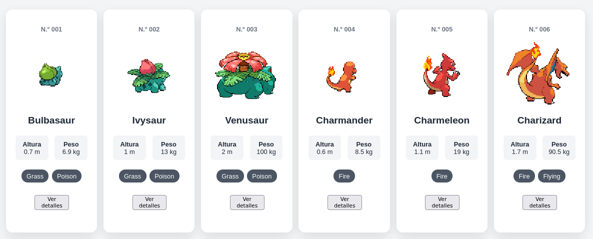

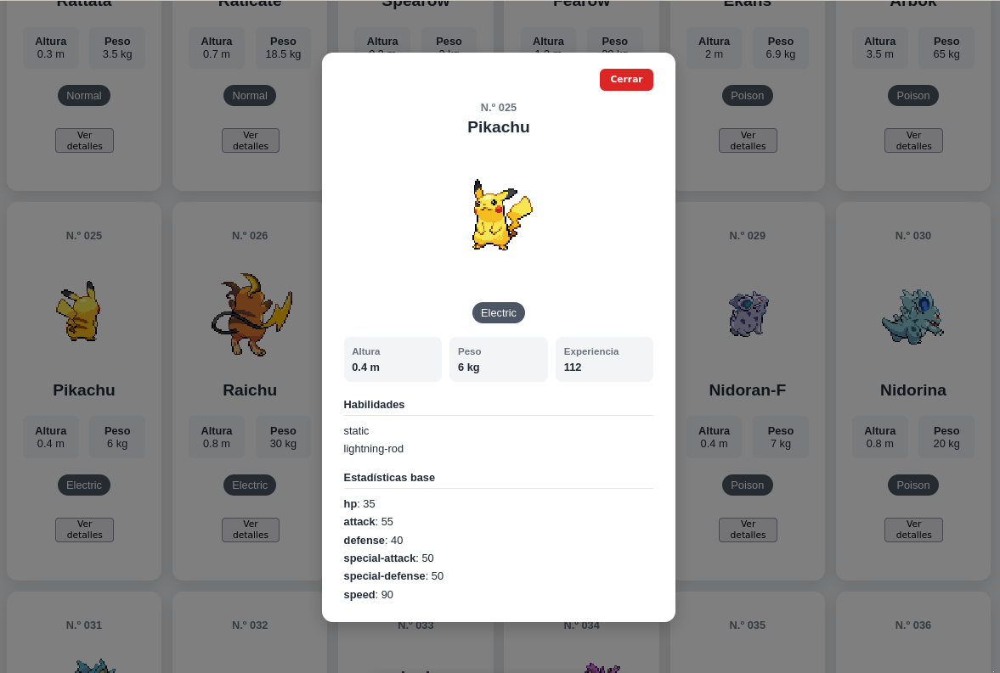


## 6. Filtrado por tipo

En este apartado he añadido un sistema de filtrado de Pokémon por tipo en el que un usuario puede seleccionar un tipo desde un desplegable y la aplicación mostrará únicamente los Pokémon que pertenecen a ese tipo cargados desde la API.

En el HTML añadiremos un selector dentro de la zona de búsqueda:

```
<div class="filtro-tipo">
  <label for="filtro-tipo">Tipo</label>

  <select id="filtro-tipo">
    <option value="todos">Todos</option>
  </select>
</div>
```

`<select>` permite al usuario seleccionar un tipo de Pokémon.

La opción `<option value="todos">Todos</option>` permite volver a mostrar todos los Pokémon. Los demás tipos se añadirán posteriormente mediante JavaScript.

En `app.js` añadiremos `const filtroTipo = document.querySelector("#filtro-tipo");`, que permite acceder desde JavaScript al `<select>` que hemos creado en el HTML. De esta manera podemos añadir opciones al selector, saber qué tipo ha seleccionado el usuario, y reaccionar cuando el usuario cambia la opción.

Ahora tenemos que obtener todos los tipos disponibles en los Pokémon cargados y añadirlos al selector:

```
const cargarTipos = (pokemons) => {
  const tipos = pokemons.flatMap((pokemon) => pokemon.tipos);

  const tiposUnicos = [...new Set(tipos)];

  tiposUnicos.sort();

  tiposUnicos.forEach((tipo) => {
    const opcion = document.createElement("option");

    opcion.value = tipo;
    opcion.textContent = tipo;

    filtroTipo.appendChild(opcion);
  });
};
```

Cada Pokémon tiene un array `tipos`, y `flatMap()` permite juntar todos esos arrays en uno solo.

Después utilizaremos `const tiposUnicos = [...new Set(tipos)];` para almacenar valores sin repetir y ordenamos con `tiposUnicos.sort();`.

Crearemos las opciones recorriendo los tipos con `tiposUnicos.forEach((tipo) => {` que los creará como elementos `<option>`, y se establecerá su valor `opcion.value = tipo;` y el texto que verá el usuario `opcion.textContent = tipo;`.

Finalmente se añade al `<select>` con `filtroTipo.appendChild(opcion);`

<br>

A continuación, tenemos que crear una función que se ejecute cuando el usuario cambie el tipo seleccionado:

```
const filtrarPorTipo = () => {
  const tipoSeleccionado = filtroTipo.value;

  if (tipoSeleccionado === "todos") {
    mostrarPokemons(pokemons);
    return;
  }

  const coincidencias = pokemons.filter((pokemon) => {
    return pokemon.tipos.includes(tipoSeleccionado);
  });

  mostrarPokemons(coincidencias);
};
```

`const tipoSeleccionado = filtroTipo.value;` obtiene el valor de la opción seleccionada.

Se comprueba que si el usuario ha seleccionado `"todos"` mediante `if (tipoSeleccionado === "todos") {
  mostrarPokemons(pokemons);
  return;
}`. En ese caso se vuelve a utilizar el array completo `pokemons` y se muestran todos los Pokémon.

Si el usuario ha seleccionado un tipo concreto, se utiliza `const coincidencias = pokemons.filter((pokemon) => {
  return pokemon.tipos.includes(tipoSeleccionado);
});`. 

Por último, `mostrarPokemons(coincidencias);` envía los Pokémon filtrados a la función que ya teníamos creada para mostrar las tarjetas.

<br>

Para que el filtrado se ejecute automáticamente cuando el usuario cambie el tipo añadiremos: 

`filtroTipo.addEventListener("change", filtrarPorTipo);`

<br>

Para finalizar, en `iniciarApp()` ya obtenemos todos los Pokémon con `pokemons = await obtenerPokemons();`, y ahora le añadiremos `cargarTipos(pokemons);`.

Por tanto, esta parte quedaría así:

```
pokemons = await obtenerPokemons();

cargarTipos(pokemons);

mensaje.textContent = "";
mostrarPokemons(pokemons);
```

Esto es importante porque `cargarTipos()` necesita recibir los Pokémon para poder descubrir qué tipos existen.

Toda la clase `app.js` terminaría de esta forma:

```
const formulario = document.querySelector("#formulario-busqueda");
const inputBusqueda = document.querySelector("#busqueda");
const mensaje = document.querySelector("#mensaje");
const resultado = document.querySelector("#resultado");
const filtroTipo = document.querySelector("#filtro-tipo");
const panelDetalles = document.querySelector("#panel-detalles");

let pokemons = [];

const obtenerPokemons = async () => {
  const respuesta = await fetch(`https://pokeapi.co/api/v2/pokemon?limit=151`);

  if (!respuesta.ok) {
    throw new Error("No se han podido cargar los Pokémon.");
  }

  const datos = await respuesta.json();

  const pokemons = await Promise.all(
    datos.results.map(async (pokemon) => {
      const respuestaPokemon = await fetch(pokemon.url);
      const datosPokemon = await respuestaPokemon.json();

      return {
        id: datosPokemon.id,
        nombre: datosPokemon.name,
        imagenBack: datosPokemon.sprites.back_default,
        imagenFront: datosPokemon.sprites.front_default,
        altura: datosPokemon.height,
        peso: datosPokemon.weight,
        tipos: datosPokemon.types.map(({ type }) => type.name),
        experiencia: datosPokemon.base_experience,
        habilidades: datosPokemon.abilities.map(({ ability }) => ability.name),
        estadisticas: datosPokemon.stats.map(({ base_stat, stat }) => ({
          nombre: stat.name,
          valor: base_stat,
        })),
      };

    })
  )
  return pokemons;
};

const formatearId = (id) => {
  return String(id).padStart(3, "0");
};

const cargarTipos = (pokemons) => {
  const tipos = pokemons.flatMap((pokemon) => pokemon.tipos);

  const tiposUnicos = [...new Set(tipos)];

  tiposUnicos.sort();

  tiposUnicos.forEach((tipo) => {
    const opcion = document.createElement("option");

    opcion.value = tipo;
    opcion.textContent = tipo;

    filtroTipo.appendChild(opcion);
  });
};

const filtrarPorTipo = () => {
  const tipoSeleccionado = filtroTipo.value;

  if (tipoSeleccionado === "todos") {
    mostrarPokemons(pokemons);
    return;
  }

  const coincidencias = pokemons.filter((pokemon) => {
    return pokemon.tipos.includes(tipoSeleccionado);
  });

  mostrarPokemons(coincidencias);
};

filtroTipo.addEventListener("change", filtrarPorTipo);

const mostrarPokemons = (pokemons) => {
  resultado.innerHTML = pokemons
    .map((pokemon) => {
      const tiposHTML = pokemon.tipos
        .map((tipo) => `<span class="tipo">${tipo}</span>`)
        .join("");

      return `
        <article class="pokemon">
          <p class="pokemon__numero">N.º ${formatearId(pokemon.id)}</p>

          <div class="galeria_pokemon">
            

            
          </div>

          <h2 class="pokemon__nombre">${pokemon.nombre}</h2>

          <div class="pokemon__datos">
            <p><strong>Altura</strong><br>${pokemon.altura / 10} m</p>
            <p><strong>Peso</strong><br>${pokemon.peso / 10} kg</p>
          </div>

          <div class="pokemon__tipos">
            ${tiposHTML}
          </div>
          <div class="boton_detalles">
            <button class="boton-detalles" data-id="${pokemon.id}">
              Ver detalles
            </button>
          </div>
        </article>
      `;
    })
    .join("");
};

const mostrarDetalles = (pokemon) => {
  const tiposHTML = pokemon.tipos
    .map((tipo) => `<span class="tipo">${tipo}</span>`)
    .join("");


  const habilidadesHTML = pokemon.habilidades
    .map((habilidad) => `<li>${habilidad}</li>`)
    .join("");

  const estadisticasHTML = pokemon.estadisticas
    .map(
      (estadistica) => `
        <li>
          <strong>${estadistica.nombre}</strong>: ${estadistica.valor}
        </li>
      `
    )
    .join("");

  panelDetalles.innerHTML = `
    <div class="panel-detalles__contenido">
      <button class="panel-detalles__cerrar" type="button">
        Cerrar
      </button>

      <p>N.º ${formatearId(pokemon.id)}</p>

      <h2>${pokemon.nombre}</h2>

      

      <div class="pokemon__tipos">
        ${tiposHTML}
      </div>

      <div class="panel-detalles__datos">
      <div>
        <strong>Altura</strong>
        <span>${pokemon.altura / 10} m</span>
      </div>

      <div>
        <strong>Peso</strong>
        <span>${pokemon.peso / 10} kg</span>
      </div>

      <div>
        <strong>Experiencia</strong>
        <span>${pokemon.experiencia}</span>
      </div>
    </div>

      <h3>Habilidades</h3>
      <ul>
        ${habilidadesHTML}
      </ul>

      <h3>Estadísticas base</h3>
      <ul>
        ${estadisticasHTML}
      </ul>
    </div>
  `;

  panelDetalles.hidden = false;
};

resultado.addEventListener("click", (evento) => {
  if (!evento.target.classList.contains("boton-detalles")) {
    return;
  }

  const id = Number(evento.target.dataset.id);

  const pokemon = pokemons.find((pokemon) => pokemon.id === id);

  mostrarDetalles(pokemon);
});

panelDetalles.addEventListener("click", (evento) => {
  if (!evento.target.classList.contains("panel-detalles__cerrar")) {
    return;
  }

  panelDetalles.hidden = true;
});

const filtrarPokemons = () => {
  const busqueda = inputBusqueda.value.trim().toLowerCase();
  const tipoSeleccionado = filtroTipo.value;

  const coincidencias = pokemons.filter((pokemon) => {
    const coincideBusqueda =
      !busqueda ||
      pokemon.nombre.includes(busqueda) ||
      String(pokemon.id) === busqueda;

    const coincideTipo =
      tipoSeleccionado === "todos" ||
      pokemon.tipos.includes(tipoSeleccionado);

    return coincideBusqueda && coincideTipo;
  });

  if (coincidencias.length === 0) {
    mensaje.textContent = "No se ha encontrado ningún Pokémon.";
    resultado.innerHTML = "";
    return;
  }

  mensaje.textContent = "";
  mostrarPokemons(coincidencias);
};

inputBusqueda.addEventListener("input", filtrarPokemons);

formulario.addEventListener("submit", (evento) => {
  evento.preventDefault();
  filtrarPokemons();
});

filtroTipo.addEventListener("change", filtrarPokemons);

const iniciarApp = async () => {
  try {
    mensaje.textContent = "Cargando Pokémon...";

    pokemons = await obtenerPokemons();

    cargarTipos(pokemons);

    mensaje.textContent = "";
    mostrarPokemons(pokemons);
  } catch (error) {
    mensaje.textContent = error.message;
  }
};

iniciarApp();
```

<br>

Para que el selector quedé bien estéticamente, lo he colocado dentro de la zona del buscador, junto al botón:

```
<div class="buscador__controles">

  <input id="busqueda" name="busqueda" type="text" placeholder="Ejemplo: pikachu o 25" autocomplete="off">

    <button type="submit">Buscar</button>

       <div class="filtro-tipo">

        <select id="filtro-tipo">
          <option value="todos">Todos</option>
        </select>

      </div>
  </div>
```

De esta manera, los controles relacionados con la búsqueda y el filtrado quedan agrupados visualmente. El código completo:

```
<!DOCTYPE html>
<html lang="es">

<head>
  <meta charset="UTF-8">
  <meta name="viewport" content="width=device-width, initial-scale=1.0">
  <title>Pokédex</title>
  <link rel="stylesheet" href="css/style.css">
</head>

<body>
  <main class="contenedor">

    <header class="encabezado">
      
    </header>

    <p class="introduccion">
      Introduce el nombre o el número de un Pokémon para obtener su información.
    </p>

    <div class="buscador-fila">

      <form id="formulario-busqueda" class="buscador">
        <label for="busqueda">Nombre o número</label>

        <div class="buscador__controles">
          <input id="busqueda" name="busqueda" type="text" placeholder="Ejemplo: pikachu o 25" autocomplete="off">

          <button type="submit">Buscar</button>

          <div class="filtro-tipo">

            <select id="filtro-tipo">
              <option value="todos">Todos</option>
            </select>
          </div>
        </div>
      </form>

      <p id="mensaje" class="mensaje" aria-live="polite"></p>

      <section id="resultado" class="resultado"></section>

      <div id="panel-detalles" class="panel-detalles" hidden></div>

    </div>
  </main>

  <script src="js/app.js"></script>
</body>

</html>
```

Esto lo complementaremos con el CSS:

```
.filtro-tipo {
  display: flex;
  align-items: center;
  gap: 0.5rem;
}

.filtro-tipo label {
  font-weight: bold;
}

.filtro-tipo select {
  width: auto;
  padding: 0.75rem;
  border: 2px solid #d1d5db;
  border-radius: 0.5rem;
  font: inherit;
  background: white;
  cursor: pointer;
}
```

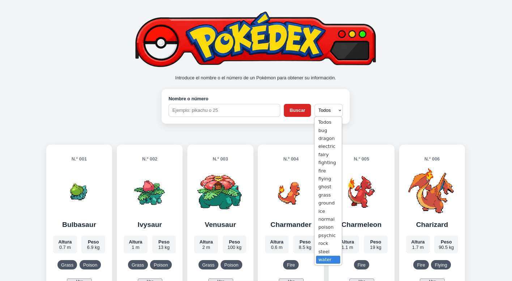

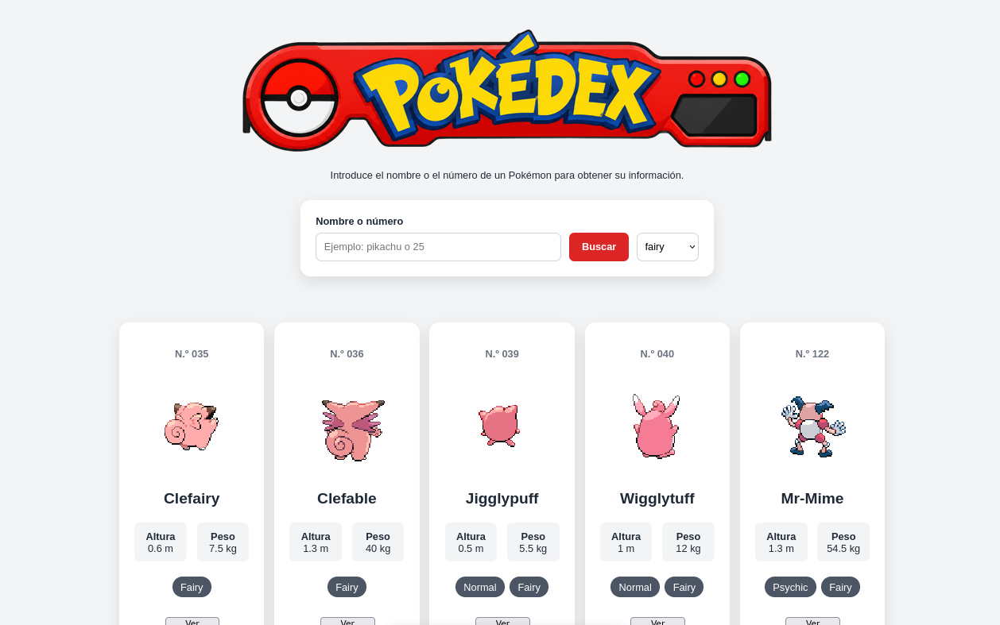


## 7. Estados y gestión de errores

Nuestra aplicación va a contemplar estos estados:

- Aplicación preparada para comenzar.
- Datos cargándose.
- Datos cargados correctamente.
- Búsqueda sin resultados.
- Error al comunicarse con PokéAPI.

Y si se producen errores:

- Se mostrará un mensaje comprensible.
- La aplicación no se quedará bloqueada.
- El usuario deberá poder volver a intentarlo.

<br>

Primero vamos a modificar el mensaje inicial para que la aplicación indique que está preparada para comenzar:

`<p id="mensaje" class="mensaje" aria-live="polite">Aplicación preparada.</p>`

Cuando se abre la página, el usuario verá: "Aplicación preparada"

El estado de carga ya lo tenemos en `iniciarApp()`: `mensaje.textContent = "Cargando Pokémon...";`

Mientras `obtenerPokemons()` está esperando la respuesta de PokéAPI, se muestra: "Cargando Pokémon..."

Actualmente, después de cargar los Pokémon tenemos `mensaje.textContent = "";
mostrarPokemons(pokemons);`. Para que el usuario sepa que los datos se han cargado correctamente, podemos mostrar: `mensaje.textContent = "Pokémon cargados correctamente.";`.

Para mejorar la gestión del error `catch (error) {
  mensaje.textContent = error.message;
}` es mejor que controlemos nosotros mismos el mensaje que verá el usuario: `catch (error) {
  mensaje.textContent =
    "No se han podido cargar los Pokémon. Comprueba tu conexión e inténtalo de nuevo.";
}`

Si queremos que la aplicación no se quede bloqueada después de un error, añadiremos un botón en el HTML:

```
<p id="mensaje" class="mensaje" aria-live="polite">
  Aplicación preparada.
</p>

<button id="boton-reintentar" type="button" hidden>
  Volver a intentarlo
</button>
```

y lo referenciaremos en la `app.js` con: `const botonReintentar = document.querySelector("#boton-reintentar");`.
Para mostrarlo cuando se produzca el error añadimos en `iniciarApp()`:

```
const iniciarApp = async () => {
  try {
    mensaje.textContent = "Cargando Pokémon...";
    botonReintentar.hidden = true;

    pokemons = await obtenerPokemons();

    cargarTipos(pokemons);

    mensaje.textContent = "Pokémon cargados correctamente.";
    mostrarPokemons(pokemons);
  } catch (error) {
    mensaje.textContent =
      "No se han podido cargar los Pokémon. Comprueba tu conexión e inténtalo de nuevo.";

    botonReintentar.hidden = false;
  }
};
```

y añadimos: `botonReintentar.addEventListener("click", iniciarApp);` para que funcione.

<br>

La búsqueda sin resultados ya la tenemos implementada en `filtrarPokemons()`

```
if (coincidencias.length === 0) {
  mensaje.textContent = "No se ha encontrado ningún Pokémon.";
  resultado.innerHTML = "";
  return;
}
```

<br>

La función final queda:

```
const iniciarApp = async () => {
  try {
    mensaje.textContent = "Cargando Pokémon...";
    botonReintentar.hidden = true;

    pokemons = await obtenerPokemons();

    cargarTipos(pokemons);

    mensaje.textContent = "Pokémon cargados correctamente.";
    mostrarPokemons(pokemons);
  } catch (error) {
    mensaje.textContent =
      "No se han podido cargar los Pokémon. Comprueba tu conexión e inténtalo de nuevo.";

    botonReintentar.hidden = false;
  }
};

botonReintentar.addEventListener("click", iniciarApp);
```

Por último, para que el botón de reintento tenga el mismo estilo general de la aplicación, añadimos al CSS:

```
#boton-reintentar {
  display: block;
  margin: 1rem auto 0;
  padding: 0.75rem 1.25rem;
  border: none;
  border-radius: 0.5rem;
  font: inherit;
  cursor: pointer;
}

#boton-reintentar[hidden] {
  display: none;
}
```

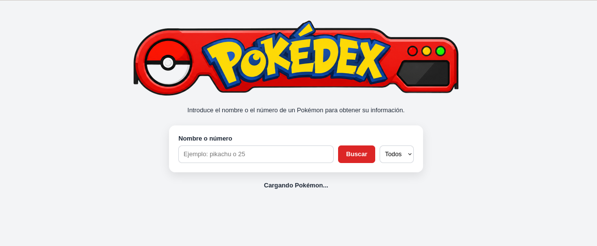

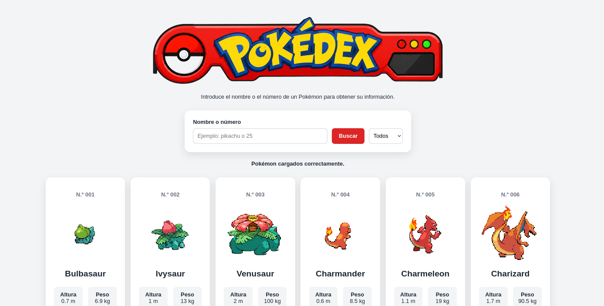

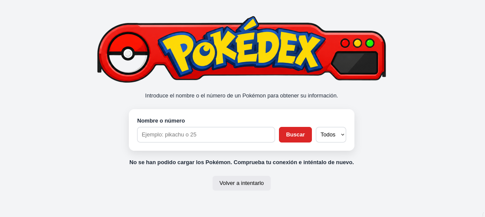

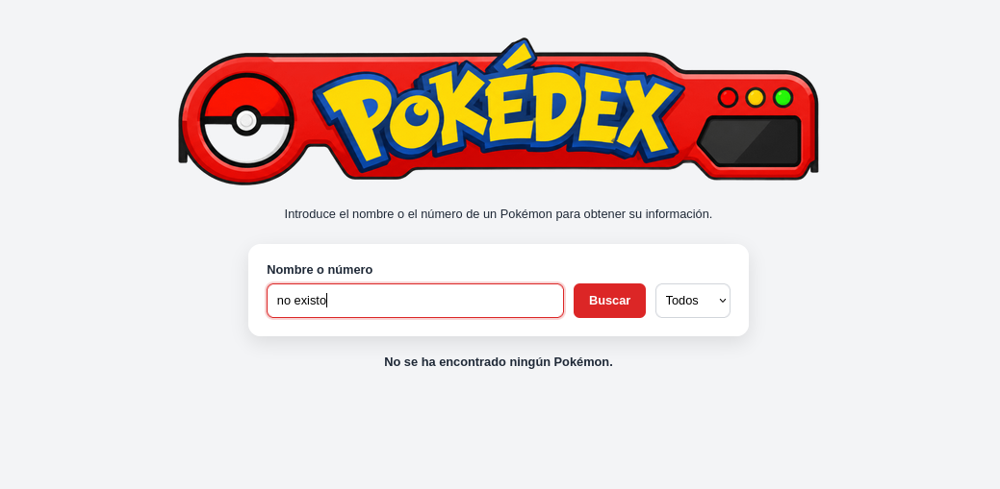


## 8. Conclusiones

Con estos cambios ya tendríamos una Pokédex funcional y preparada para errores. Lo único que falta es añadir más cambios al programa para cambiarla al gusto de cada uno.

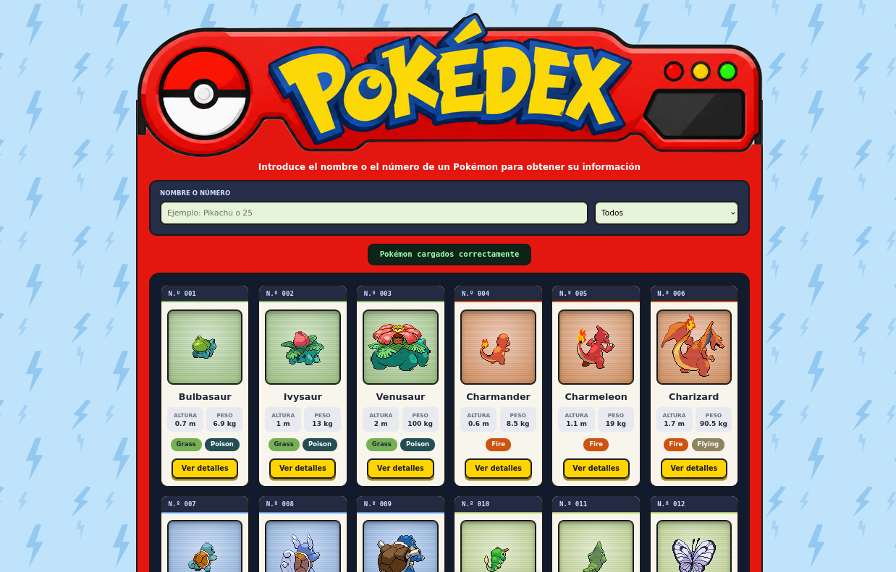

<br>

- **Dificultades encontradas**: las únicas dificultades que encontré fueron la programación de la app en JavaScript, ya que es un lenguaje que no conozco demasiado, y tuve que apoyarme de algo de ayuda de Internet.

- **Conocimientos adquiridos**: gracias a esta actividad me he familiarizado un poco más con JavaScript para hacer algunas funciones sencillas con más facilidad.

- **Posibles mejoras futuras**: se pueden mejorar bastantes cosas, sobre todo en el apartado visual, adaptarla de inglés a español, ordenar por id o de la A-Z, mostrar más datos de cada Pokémon...
