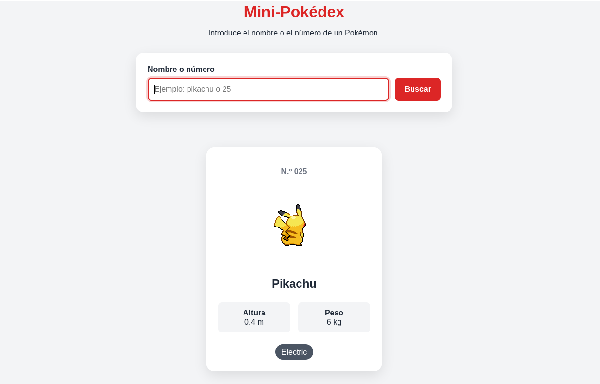
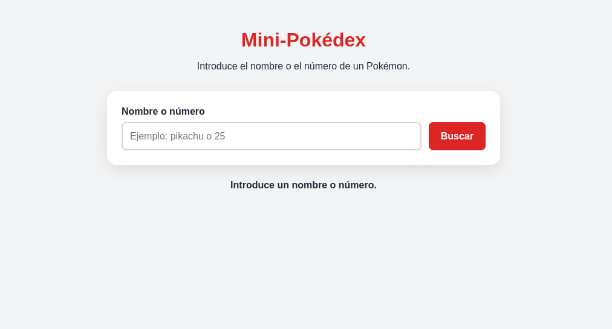

# Desarrollo de una Pokédex con JavaScript

## 1. Punto de partida

Para comenzar el proyecto he creado una mini-pokedex inicial que contiene un html y css sencillos, y una app.js que se conecta a [PokéAPI](https://pokeapi.co/) y realiza la búsqueda de un Pokémon devolviendo algunos de sus datos.





### Estructura de carpetas y archivos inicial

```
mini-pokedex/
├── assets/
│   └── img/
├── css/
│   └── style.css
├── js/
│   └── app.js
├── index.html
└── README.md
```

### Funcionalidades ya implementadas

- Buscar un Pokémon introduciendo su nombre o número

    `const busqueda = inputBusqueda.value.trim().toLowerCase();`

- Obtener datos desde [PokéAPI](https://pokeapi.co/) extrayendo el número, nombre, imagen, altura, peso y tipos

    ```const url = `https://pokeapi.co/api/v2/pokemon/${busqueda}`;
const respuesta = await fetch(url);```

- Mostrar la información del Pokémon creando dinámicamente una tarjeta con sus datos

    `mostrarPokemon(pokemon);`

- Mostrar los tipos del Pokémon (si tiene uno o varios)

    
    ```pokemon.tipos.map((tipo) => `<span class="tipo">${tipo}</span>`).join("");```


- Formatear el número del Pokémon añadiendo ceros delante del número para que siempre tenga tres cifras

    `formatearId(25);`

- Mostrar un mensaje de carga mientras se busca el Pokémon

    `mensaje.textContent = "Cargando...";`

- Desactivar el botón "Buscar" mientras se realiza una búsqueda para evitar que se hagan varias búsquedas simultáneamente

    `botonBuscar.disabled = true;`

- Volver a activar el botón "Buscar" cuando la búsqueda termina

    `botonBuscar.disabled = false;`

- Permitir buscar pulsando Enter

    `formulario.addEventListener("submit", async (evento) => {`

- Limpiar el formulario después de una búsqueda correcta, vaciando el campo de búsqueda y volviendo a colocar el cursor sobre él

    `inputBusqueda.value = "";`
    
    `inputBusqueda.focus();`

<br>    

La app también gestiona Pokémon inexistentes y otros errores controlados como al pulsar el botón de "Buscar" sin haber introducido nada en la barra de búsqueda.





Commits de este punto de partida: 

https://github.com/Atthemyg/pgl-2dam/commit/17fb5001003414a78b19f438b13954b100ede130

https://github.com/Atthemyg/pgl-2dam/commit/4083b9295523b92f6cc9857e3b749898707f7aff


## 2. Cambio de sprite


```
<div class="galeria_pokemon">
      
      
</div>
```