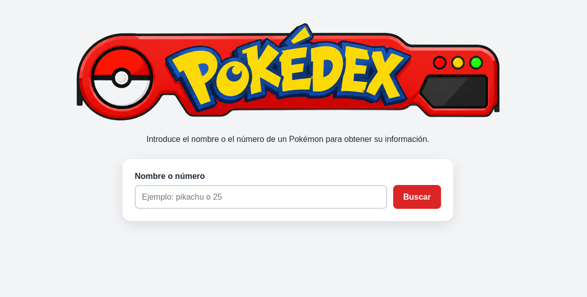

# Desarrollo de una Pokédex con JavaScript

## 1. Punto de partida

Para comenzar el proyecto he creado una mini-pokedex inicial que contiene un html y css sencillos, y una app.js que se conecta a [PokéAPI](https://pokeapi.co/) y realiza la búsqueda de un Pokémon devolviendo algunos de sus datos.


### Estructura de carpetas y archivos inicial

```
mini-pokedex/
├── assets/
│   └── img/
├── css/
│   └── style.css
├── js/
│   └── app.js
├── index.html
└── README.md
```

### Funcionalidades ya implementadas

- Buscar un Pokémon introduciendo su nombre o número

    `const busqueda = inputBusqueda.value.trim().toLowerCase();`

- Obtener datos desde [PokéAPI](https://pokeapi.co/) extrayendo el número, nombre, imagen, altura, peso y tipos

    ```const url = `https://pokeapi.co/api/v2/pokemon/${busqueda}`;
const respuesta = await fetch(url);```

- Mostrar la información del Pokémon creando dinámicamente una tarjeta con sus datos

    `mostrarPokemon(pokemon);`

- Mostrar los tipos del Pokémon (si tiene uno o varios)

    
    ```pokemon.tipos.map((tipo) => `<span class="tipo">${tipo}</span>`).join("");```


- Formatear el número del Pokémon añadiendo ceros delante del número para que siempre tenga tres cifras

    `formatearId(25);`

- Mostrar un mensaje de carga mientras se busca el Pokémon

    `mensaje.textContent = "Cargando...";`

- Desactivar el botón "Buscar" mientras se realiza una búsqueda para evitar que se hagan varias búsquedas simultáneamente

    `botonBuscar.disabled = true;`

- Volver a activar el botón "Buscar" cuando la búsqueda termina

    `botonBuscar.disabled = false;`

- Permitir buscar pulsando Enter

    `formulario.addEventListener("submit", async (evento) => {`

- Limpiar el formulario después de una búsqueda correcta, vaciando el campo de búsqueda y volviendo a colocar el cursor sobre él

    `inputBusqueda.value = "";`
    
    `inputBusqueda.focus();`

<br>    

La app también gestiona Pokémon inexistentes y otros errores controlados como al pulsar el botón de "Buscar" sin haber introducido nada en la barra de búsqueda.


Commits de este punto de partida: 

https://github.com/Atthemyg/pgl-2dam/commit/17fb5001003414a78b19f438b13954b100ede130

https://github.com/Atthemyg/pgl-2dam/commit/4083b9295523b92f6cc9857e3b749898707f7aff


## 2. Carga inicial

He añadido un encabezado con el logotipo de la Pokedex añadiendo al html la imagen:

```
<header class="encabezado">
      
</header>
```

Y haciendo algunos cambios en el css para que quede centrado en la pantalla:

```
body {
  margin: 0;
  padding: 0.5rem 1rem 2rem;
  font-family: Arial, sans-serif;
  color: #1f2937;
  background: #f3f4f6;
}

.contenedor {
  width: min(100%, 650px);
  margin: 0 auto;
}

.encabezado {
  width: 100%;
  text-align: center;
  position: relative;
  z-index: 1;
}

.encabezado__imagen {
  display: block;
  width: 100%;
  height: auto;
  margin: 0 auto;
  transform: scale(1.3);
}

.introduccion {
  margin-bottom: 0.5rem; 
  text-align: center;
  margin-top: -170px;
}

.buscador {
  padding: 1.5rem;
  background: white;
  border-radius: 1rem;
  box-shadow: 0 8px 25px rgb(0 0 0 / 10%);
  margin-top: 30px;
  position: relative;
  z-index: 2;
}
```

<br>




## 3. Cambio de sprite

Al buscar un Pokémon la imagen que aparecerá por defecto es de espaldas, pero al pasar el cursor por encima, la imagen cambia a la del Pokémon de frente.

Para conseguirlo modifico el código de JavaScript para que tome las dos imágenes de la API:

```
return {
    id: datos.id,
    nombre: datos.name,
    imagenBack: datos.sprites.back_default,
    imagenFront: datos.sprites.front_default,
    altura: datos.height,
    peso: datos.weight,
    tipos: datos.types.map(({ type }) => type.name),
  };
```

Y a continuación modifico el innerHTML para que ambas imágenes qse muestren:

```
<div class="galeria_pokemon">
      
      
</div>
```
Por último, modifico el css para que las imágenes queden superpuestas en la misma posición, y que además se produzca una transición de opacidad al cambiar la imagen cuando se le pase el cursor por encima. 

```
.galeria_pokemon {
  display: grid;
  width: 180px;
  height: 180px;
  image-rendering: pixelated;
  margin: 0 auto;
}

.pokemon__imagen_back, 
.pokemon__imagen_front {
  position: absolute;
  width: 180px;
  height: 180px;
  image-rendering: pixelated;
  transition: opacity 0.25s ease-in-out;
}

.pokemon__imagen_back {
  opacity: 1;
}

.pokemon__imagen_front {
  opacity: 0;
}

.pokemon:hover .pokemon__imagen_front {
  opacity: 1;
}

.pokemon:hover .pokemon__imagen_back {
  opacity: 0;
}
```
<br>


