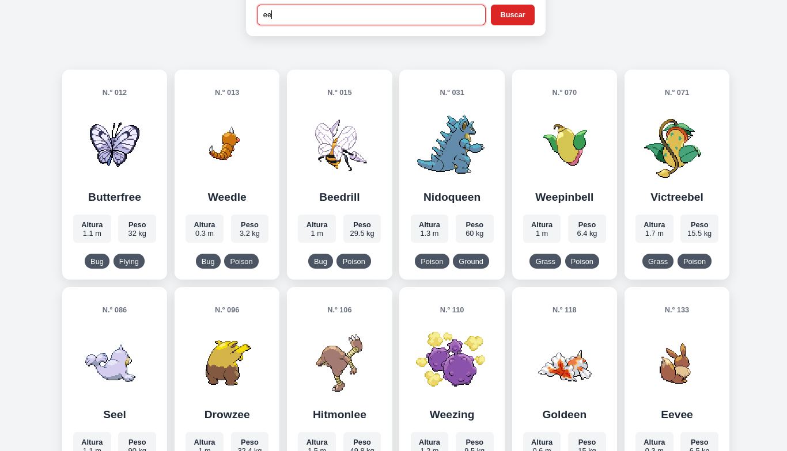

# Desarrollo de una Pokédex con JavaScript

## 1. Punto de partida

Para comenzar el proyecto he creado una mini-pokedex inicial que contiene un html y css sencillos, y una app.js que se conecta a [PokéAPI](https://pokeapi.co/) y realiza la búsqueda de un Pokémon devolviendo algunos de sus datos.


### Estructura de carpetas y archivos inicial

```
mini-pokedex/
├── assets/
│   └── img/
├── css/
│   └── style.css
├── js/
│   └── app.js
├── index.html
└── README.md
```

### Funcionalidades ya implementadas

- Buscar un Pokémon introduciendo su nombre o número

    `const busqueda = inputBusqueda.value.trim().toLowerCase();`

- Obtener datos desde [PokéAPI](https://pokeapi.co/) extrayendo el número, nombre, imagen, altura, peso y tipos

    ```const url = `https://pokeapi.co/api/v2/pokemon/${busqueda}`;
const respuesta = await fetch(url);```

- Mostrar la información del Pokémon creando dinámicamente una tarjeta con sus datos

    `mostrarPokemon(pokemon);`

- Mostrar los tipos del Pokémon (si tiene uno o varios)

    
    ```pokemon.tipos.map((tipo) => `<span class="tipo">${tipo}</span>`).join("");```


- Formatear el número del Pokémon añadiendo ceros delante del número para que siempre tenga tres cifras

    `formatearId(25);`

- Mostrar un mensaje de carga mientras se busca el Pokémon

    `mensaje.textContent = "Cargando...";`

- Desactivar el botón "Buscar" mientras se realiza una búsqueda para evitar que se hagan varias búsquedas simultáneamente

    `botonBuscar.disabled = true;`

- Volver a activar el botón "Buscar" cuando la búsqueda termina

    `botonBuscar.disabled = false;`

- Permitir buscar pulsando Enter

    `formulario.addEventListener("submit", async (evento) => {`

- Limpiar el formulario después de una búsqueda correcta, vaciando el campo de búsqueda y volviendo a colocar el cursor sobre él

    `inputBusqueda.value = "";`
    
    `inputBusqueda.focus();`

<br>    

La app también gestiona Pokémon inexistentes y otros errores controlados como al pulsar el botón de "Buscar" sin haber introducido nada en la barra de búsqueda.


Commits de este punto de partida: 

https://github.com/Atthemyg/pgl-2dam/commit/17fb5001003414a78b19f438b13954b100ede130

https://github.com/Atthemyg/pgl-2dam/commit/4083b9295523b92f6cc9857e3b749898707f7aff


## 2. Carga inicial

He añadido un encabezado con el logotipo de la Pokedex añadiendo al html la imagen:

```
<header class="encabezado">
      
</header>
```

Y haciendo algunos cambios en el css para que quede centrado en la pantalla:

```
body {
  margin: 0;
  padding: 0.5rem 1rem 2rem;
  font-family: Arial, sans-serif;
  color: #1f2937;
  background: #f3f4f6;
}

.contenedor {
  width: min(100%, 650px);
  margin: 0 auto;
}

.encabezado {
  width: 100%;
  text-align: center;
  position: relative;
  z-index: 1;
}

.encabezado__imagen {
  display: block;
  width: 100%;
  height: auto;
  margin: 0 auto;
  transform: scale(1.3);
}

.introduccion {
  margin-bottom: 0.5rem; 
  text-align: center;
  margin-top: -170px;
}

.buscador {
  padding: 1.5rem;
  background: white;
  border-radius: 1rem;
  box-shadow: 0 8px 25px rgb(0 0 0 / 10%);
  margin-top: 30px;
  position: relative;
  z-index: 2;
}
```

<br>


## 3. Cambio de sprite

Al buscar un Pokémon la imagen que aparecerá por defecto es de espaldas, pero al pasar el cursor por encima, la imagen cambia a la del Pokémon de frente.

Para conseguirlo modifico el código de JavaScript para que tome las dos imágenes de la API:

```
return {
    id: datos.id,
    nombre: datos.name,
    imagenBack: datos.sprites.back_default,
    imagenFront: datos.sprites.front_default,
    altura: datos.height,
    peso: datos.weight,
    tipos: datos.types.map(({ type }) => type.name),
  };
```

Y a continuación modifico el innerHTML para que ambas imágenes se muestren:

```
<div class="galeria_pokemon">
      
      
</div>
```
Por último, modifico el css para que las imágenes queden superpuestas en la misma posición, y que además se produzca una transición de opacidad al cambiar la imagen cuando se le pase el cursor por encima. 

```
.galeria_pokemon {
  display: grid;
  width: 180px;
  height: 180px;
  image-rendering: pixelated;
  margin: 0 auto;
}

.pokemon__imagen_back, 
.pokemon__imagen_front {
  position: absolute;
  width: 180px;
  height: 180px;
  image-rendering: pixelated;
  transition: opacity 0.25s ease-in-out;
}

.pokemon__imagen_back {
  opacity: 1;
}

.pokemon__imagen_front {
  opacity: 0;
}

.pokemon:hover .pokemon__imagen_front {
  opacity: 1;
}

.pokemon:hover .pokemon__imagen_back {
  opacity: 0;
}
```
<br>


## 4. Barra de búsqueda

Para mejorar las búsquedas, he implementado algunas modificaciones. En lugar de buscar al Pokémon únicamente por su nombre completo o número, ahora se pueden buscar por un fragmento de su nombre también.

Para ello, ya no mostraremos un solo Pokémon, sino que mostraremos por ejemplo 151. 

Primero, hay que cambiar la función de `const obtenerPokemon = async (busqueda) => {`, la cual solo obtenía un Pokémon, por `const obtenerPokemons = async () => {`, ya que no necesitamos busqueda como parámetro porque la función ya no recibe una búsqueda.

Luego, tenemos que reemplazar la anterior petición a la API, la cual únicamente devolvía el Pokémon a buscar:

``const url = `https://pokeapi.co/api/v2/pokemon/${busqueda}`;``

`const respuesta = await fetch(url);`

por una que devuelve una lista de 151 Pokémon:

``const respuesta = await fetch(`https://pokeapi.co/api/v2/pokemon?limit=151`);``

Una vez hecho esto, haremos una petición por cada Pokémon con la siguiente función: 

```
const datos = await respuesta.json();

const pokemons = await Promise.all(
  datos.results.map(async (pokemon) => {
    const respuestaPokemon = await fetch(pokemon.url);
    const datosPokemon = await respuestaPokemon.json();
```

`datos.results` es la lista de los 151 Pokémon que recorre `.map()`. Una vez que se asegura de que el Pokémon existe, `const respuestaPokemon = await fetch(pokemon.url);` realiza la siguiente petición que es algo como: "Vale, dame todos los datos de Pikachu."

Después, `const datosPokemon = await respuestaPokemon.json();` guarda todos sus datos.

Ahora podemos crear nuestro objeto Pokémon filtrando la información que nos interese:

```
return {
  id: datosPokemon.id,
  nombre: datosPokemon.name,
  imagenBack: datosPokemon.sprites.back_default,
  imagenFront: datosPokemon.sprites.front_default,
  altura: datosPokemon.height,
  peso: datosPokemon.weight,
  tipos: datosPokemon.types.map(({ type }) => type.name),
};
```

El `Promise.all(...)` espera a que todas nuestras operaciones asíncronas terminen. Por lo que al final, tendremos 151 `pokemons`.

Nuestra función `obtenerPokemons` completa quedaría así:

```
const obtenerPokemons = async () => {
const respuesta = await fetch(`https://pokeapi.co/api/v2/pokemon?limit=151`);

  if (!respuesta.ok) {
    throw new Error("No se han podido cargar los Pokémon.");
  }

  const datos = await respuesta.json();

  const pokemons = await Promise.all(
    datos.results.map(async (pokemon) => {
      const respuestaPokemon = await fetch(pokemon.url);
      const datosPokemon = await respuestaPokemon.json();

      return {
        id: datosPokemon.id,
        nombre: datosPokemon.name,
        imagenBack: datosPokemon.sprites.back_default,
        imagenFront: datosPokemon.sprites.front_default,
        altura: datosPokemon.height,
        peso: datosPokemon.weight,
        tipos: datosPokemon.types.map(({ type }) => type.name),
      };

    })
  )
  return pokemons;
};
```

Para guardar nuestros 151 Pokémon crearemos una variable `let pokemons = [];`, así no tendremos que volver a pedirlos a la API cada vez que escribamos en el buscador.

Ahora vamos a cambiar nuestra función `const mostrarPokemon = (pokemon) => {` por `const mostrarPokemons = (pokemons) => {` que recibirá nuestra lista.

Sustituiremos:
  ```
  const tiposHTML = pokemon.tipos
    .map((tipo) => `<span class="tipo">${tipo}</span>`)
    .join("");
  ```
por:

```
resultado.innerHTML = pokemons
  .map((pokemon) => {
    const tiposHTML = pokemon.tipos
        .map((tipo) => `<span class="tipo">${tipo}</span>`)
        .join("");
```
para que recorra todos los Pokémon y cree un HTML para cada uno.

La función `mostrarPokemons` completa sería esta:

```
const mostrarPokemons = (pokemons) => {
  resultado.innerHTML = pokemons
    .map((pokemon) => {
      const tiposHTML = pokemon.tipos
        .map((tipo) => `<span class="tipo">${tipo}</span>`)
        .join("");

      return `
        <article class="pokemon">
          <p class="pokemon__numero">N.º ${formatearId(pokemon.id)}</p>

          <div class="galeria_pokemon">
            

            
          </div>

          <h2 class="pokemon__nombre">${pokemon.nombre}</h2>

          <div class="pokemon__datos">
            <p><strong>Altura</strong><br>${pokemon.altura / 10} m</p>
            <p><strong>Peso</strong><br>${pokemon.peso / 10} kg</p>
          </div>

          <div class="pokemon__tipos">
            ${tiposHTML}
          </div>
        </article>
      `;
    })
    .join("");
};
```

<br>

Modificando las funciones anteriores hemos obtenido los 151 Pokémon, pero todavía falta nuestro objetivo principal, que se pueda buscar nuestro objetivo con solo un fragmento de su nombre.

Para conseguirlo, vamos a crear la función `const filtrarPokemons = () => {` que se encargará de leer lo que ha escrito el usuario y decidir qué Pokémon mostrar.

```
const filtrarPokemons = () => {
  const busqueda = inputBusqueda.value.trim().toLowerCase();

  if (!busqueda) {
    mensaje.textContent = "";
    mostrarPokemons(pokemons);
    return;
  }

  const coincidencias = pokemons.filter((pokemon) => {
    return (
      pokemon.nombre.includes(busqueda) ||
      String(pokemon.id) === busqueda
    );
  });
```

El `const busqueda = inputBusqueda.value.trim().toLowerCase();` obtiene lo que ha escrito el usuario, elimina los espacios al principio y al final con `.trim()`, y convierte todo a minúscula con `.toLowerCase()`.


`if (!busqueda) {
    mensaje.textContent = "";
    mostrarPokemons(pokemons);
    return;
  }` 
  permite mostrar los 151 Pokémon si el buscador está vacío.

Por último, `const coincidencias = pokemons.filter((pokemon) => {` sirve para quedarse solamente con los elementos que cumplen una condición; `pokemon.nombre.includes(busqueda)` se asegura de que el nombre contiene lo que ha escrito el usuario (por ejemplo: "charmander".includes("char") da true); y `String(pokemon.id) === busqueda` busca por el número tras haberlo convertido en texto.

Por otro lado, para controlar errores si no encontramos ningún Pokémon que coincida añadiremos:

```
if (coincidencias.length === 0) {
    mensaje.textContent = "No se ha encontrado ningún Pokémon.";
    resultado.innerHTML = "";
    return;
  }
```

en el caso contrario devolverá:

```
mensaje.textContent = "";
mostrarPokemons(coincidencias);
```

<br>

Cuando tengamos eso, para hacer que la app filtre mientras escribimos vamos a incluir esta línea: `inputBusqueda.addEventListener("input", filtrarPokemons);` y a cambiar el evento del formulario por:

```
formulario.addEventListener("submit", (evento) => {
  evento.preventDefault();
  filtrarPokemons();
});
```

Antes el formulario hacía una petición a la API cada vez que pulsabamos "Buscar". Eso ya no tiene sentido porque los 151 Pokémon ya están guardados en `pokemons`.

`evento.preventDefault();` sirve para que el formulario no intente recargar la página. Después simplemente se ejecuta el `filtrarPokemons()`.

<br>

Lo último que nos falta es la función `const iniciarApp = async () => {`, que se encargará de iniciar la app.

```
const iniciarApp = async () => {
  try {
    mensaje.textContent = "Cargando Pokémon...";

    pokemons = await obtenerPokemons();

    mensaje.textContent = "";
    mostrarPokemons(pokemons);
  } catch (error) {
    mensaje.textContent = error.message;
  }
};
```

`pokemons = await obtenerPokemons();` descarga los 151 Pokémon y los guarda en nuestra variable global `pokemons` antes de que `mostrarPokemons(pokemons);` los muestre creando sus correspondientes tarjetas. Si llega a ocurrir algún error se mostrará un mensaje.


En resumen, todo el código de la app.js sería:

```
const formulario = document.querySelector("#formulario-busqueda");
const inputBusqueda = document.querySelector("#busqueda");
const mensaje = document.querySelector("#mensaje");
const resultado = document.querySelector("#resultado");

let pokemons = [];

const obtenerPokemons = async () => {
  const respuesta = await fetch(`https://pokeapi.co/api/v2/pokemon?limit=151`);

  if (!respuesta.ok) {
    throw new Error("No se han podido cargar los Pokémon.");
  }

  const datos = await respuesta.json();

  const pokemons = await Promise.all(
    datos.results.map(async (pokemon) => {
      const respuestaPokemon = await fetch(pokemon.url);
      const datosPokemon = await respuestaPokemon.json();

      return {
        id: datosPokemon.id,
        nombre: datosPokemon.name,
        imagenBack: datosPokemon.sprites.back_default,
        imagenFront: datosPokemon.sprites.front_default,
        altura: datosPokemon.height,
        peso: datosPokemon.weight,
        tipos: datosPokemon.types.map(({ type }) => type.name),
      };

    })
  )
  return pokemons;
};

const formatearId = (id) => {
  return String(id).padStart(3, "0");
};

const mostrarPokemons = (pokemons) => {
  resultado.innerHTML = pokemons
    .map((pokemon) => {
      const tiposHTML = pokemon.tipos
        .map((tipo) => `<span class="tipo">${tipo}</span>`)
        .join("");

      return `
        <article class="pokemon">
          <p class="pokemon__numero">N.º ${formatearId(pokemon.id)}</p>

          <div class="galeria_pokemon">
            

            
          </div>

          <h2 class="pokemon__nombre">${pokemon.nombre}</h2>

          <div class="pokemon__datos">
            <p><strong>Altura</strong><br>${pokemon.altura / 10} m</p>
            <p><strong>Peso</strong><br>${pokemon.peso / 10} kg</p>
          </div>

          <div class="pokemon__tipos">
            ${tiposHTML}
          </div>
        </article>
      `;
    })
    .join("");
};

const filtrarPokemons = () => {
  const busqueda = inputBusqueda.value.trim().toLowerCase();

  if (!busqueda) {
    mensaje.textContent = "";
    mostrarPokemons(pokemons);
    return;
  }

  const coincidencias = pokemons.filter((pokemon) => {
    return (
      pokemon.nombre.includes(busqueda) ||
      String(pokemon.id) === busqueda
    );
  });

  if (coincidencias.length === 0) {
    mensaje.textContent = "No se ha encontrado ningún Pokémon.";
    resultado.innerHTML = "";
    return;
  }

  mensaje.textContent = "";
  mostrarPokemons(coincidencias);
};

inputBusqueda.addEventListener("input", filtrarPokemons);

formulario.addEventListener("submit", (evento) => {
  evento.preventDefault();
  filtrarPokemons();
});

const iniciarApp = async () => {
  try {
    mensaje.textContent = "Cargando Pokémon...";

    pokemons = await obtenerPokemons();

    mensaje.textContent = "";
    mostrarPokemons(pokemons);
  } catch (error) {
    mensaje.textContent = error.message;
  }
};

iniciarApp();
```

Para finalizar, hacemos un pequeño cambio en el css para colocar 6 tarjetas por fila y centradas en la pantalla:

```
.resultado {
  display: grid;
  grid-template-columns: repeat(6, 1fr);
  gap: 1rem;
  justify-content: center;
}
```

Con este apartado hecho, nuestra app:

- Realiza la búsqueda ignorando espacios innecesarios y diferencias entre mayúsculas y minúsculas

- Muestra únicamente las tarjetas que coincidan con lo que ha escrito el usuario

- Muestra nuevamente los 151 Pokémon cuando la barra esta vacía

<br>




